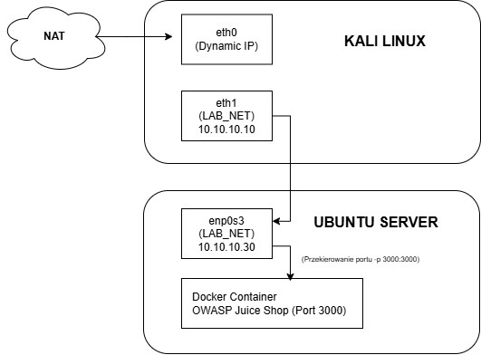

# cybersecurity-home-lab
# Isolated Cybersecurity Testing Environment (Home Lab)

## 1. Opis Projektu (Project Overview)
Projekt polega na zaprojektowaniu, wdrożeniu i zabezpieczeniu odizolowanego laboratorium metodą wirtualizacji (Home Lab). Środowisko zostało stworzone w celu bezpiecznego przeprowadzania testów penetracyjnych aplikacji webowych oraz analizy podatności, bez ryzyka wpływu na fizyczną sieć lokalną (LAN).

**Główne komponenty środowiska:**
* **Hiperwizor:** Oracle VM VirtualBox
* **Maszyna Atakująca (Attacker):** Kali Linux (najnowsza wersja dystrybucyjna)
* **Maszyna Podatna (Victim):** Ubuntu Server z uruchomioną celowo podatną aplikacją webową **OWASP Juice Shop** w kontenerze Docker.

---

## 2. Architektura Sieci (Network Architecture)
Kluczowym założeniem projektu było zapewnienie pełnej izolacji maszyn wirtualnych. Zastosowano sieć typu **NAT Network** (Sieć NAT) w VirtualBox, o adresacji `10.0.2.0/24`.

* **Kali Linux IP:** `10.10.10.10`
* **Ubuntu Server (Juice Shop) IP:** `10.10.10.30`

Dzięki takiej konfiguracji:
1. Maszyny wirtualne mogą komunikować się między sobą.
2. System Kali Linux dostęp do Internetu (w celu pobierania aktualizacji/pakietów).
3. **Sieć lokalna hosta (LAN) jest chroniona** – ruch z maszyn wirtualnych nie ma bezpośredniego dostępu do urządzeń w domowej sieci.

**

---

## 3. Procedura Wdrożenia Krok po Kroku (Deployment Steps)

### Krok 1: Instalacja Konfiguracja oby maszyn w VirtualBox
1. Pobrem obrazy obu maszyn z oficjalnych stron
2. Skonfigurowałem je tak aby działały płynnie na moim komputerze

### Krok 2: Konfiguracja Sieci w VirtualBox dla obu maszyn
1. Wszedlem w ustawienia sieci obu maszyn.
2. Dla Kali Linux ustawiłem dwie karty sieciowe, NAT oraz Internal Network z nazwą LAB_NET
3. W Ubuntu Server do momentu pobrania Dockera oraz OWASP Juice Shop miałem karte NAT, natomiast po konfiguracji dockera zmieniłem na Internal Network z nazwą LAB_NET 

c.n.d nie chce mi sie :3
